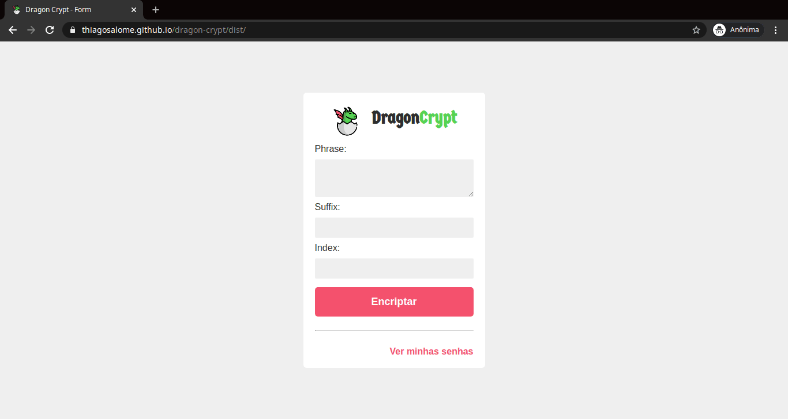
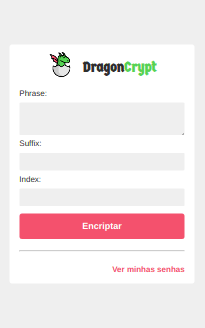

<!-- Logo -->
<p align="center">
  
</p>

<!-- Badges -->
<p align="center">
  <a href="https://thiagosalome.github.io/dragon-crypt/dist/" target="_blank">
  
  
  
  
</p>

<!-- Indice-->
<p align="center">
 <a href="#computer-sobre">Sobre</a> •
 <a href="#gear-funcionalidades">Funcionalidades</a> •
 <a href="#wrench-tecnologias-utilizadas">Tecnologias</a> •
 <a href="#movie_camera-preview">Preview</a> •
 <a href="#rocket-executando-o-projeto">Executando</a> •
 <a href="#memo-licença">Licença</a>
</p>

## :computer: Sobre

O **DragonCrypt** foi um projeto criado com o objetivo de encriptar uma frase digitada pelo usuário com base em um índice e um sufixo determinado por ele. Basicamente ele pega a primeira letra de cada palavra da frase, e a partir do resultado gerado ele e adiciona o sufixo determinado na entrada (sendo ele composto por uma ou mais letras do alfabeto) no índice que ele passou no segundo input.

## :gear: Funcionalidades

- [x] Criptografar uma frase e gerar uma senha com base nas seguintes entradas:
  - [x] Frase: Uma frase qualquer pensada pelo usuário (Ex: Mais vale um pássaro na mão do que dois voando)
  - [x] Sufixo: Uma determinada sequência de caracteres
  - [x] Índice: Um número referente ao índice de um determinado caractere da frase
- [x] Salvar a senha gerada em Local Storage
- [x] Instalar a aplicação no dispositivo do usuário com a possibilidade de utilizá-lo offline (PWA)

## :wrench: Tecnologias Utilizadas

<table>
  <tbody>
    <tr>
      <td align="center">
        
        <p>Pug</p>
      </td>
      <td align="center">
        
        <p>SASS</p>
      </td>
      <td align="center">
        
        <p>Javascript</p>
      </td>
      <td align="center">
        
        <p>PWA</p>
      </td>
      <td align="center">
        
        <p>Webpack</p>
      </td>
    </tr>
  </tbody>
</table>

## :movie_camera: Preview

### Web



### Mobile



## :rocket: Executando o projeto

### Pré-requisitos

Para executar o projeto é necessário ter instalado as seguintes ferramentas:

<table>
  <tbody>
    <tr>
      <td align="center">
        <a href='https://git-scm.com/downloads' target='_blank'>
          
          <p>GIT</p>
        </a>
      </td>
      <td>
        <a href='https://git-scm.com/downloads' target='_blank'>
          
          <p>Node.js</p>
        </a>
      </td>
    </tr>
  </tbody>
</table>

### Rodando aplicação web

```bash
# Clone este repositório
$ git clone https://github.com/thiagosalome/dragon-crypt

# Acesse a pasta do projeto no seu terminal/cmd
$ cd dragon-crypt

# Vá para a pasta da aplicação Front End
$ cd web

# Instale as dependências
$ npm install

# Execute a aplicação em modo de desenvolvimento
$ npm run dev

# A aplicação será aberta na porta:3000 - acesse http://localhost:3000
```

## :memo: Licença

Este projeto esta sobe a licença [MIT](./LICENCE).
